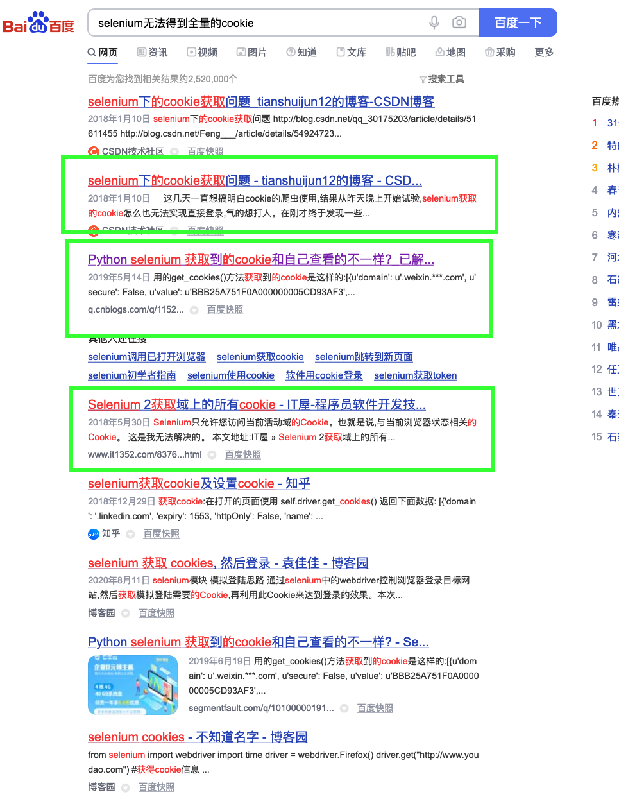
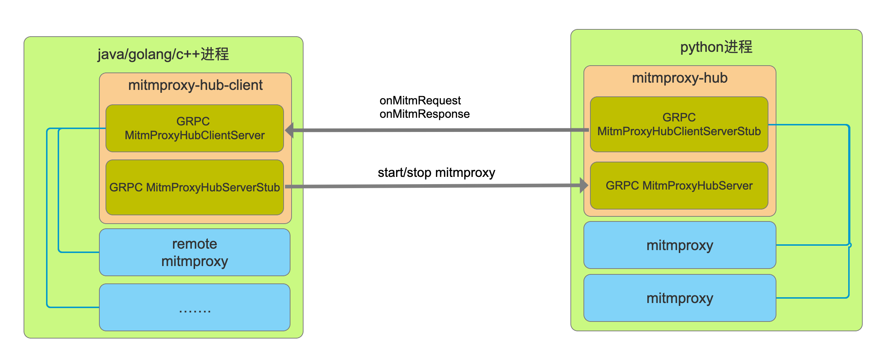

# 欢迎使用goniub 我带来的不仅仅是一个框架，最重要是做爬虫的思想。

#### 感谢大家的关注，因为各种原因文档迟迟未更新。但是还是有“识货”的人，进去看了goniub的源码。因为觉得好用所以给了star和fork，我再次由衷感谢大家对goniub的认可。

** goniub是一个java爬虫工具库，如果你想提高开发爬虫的效率，如果你用selenium老是被网站检测到机器识别，如果你想实现js注入。请你立马用goniub。**

### 添加maven依赖
```xml
<dependency>
  <groupId>com.deep007</groupId>
  <artifactId>goniub</artifactId>
  <version>2.0.1</version>
</dependency>
```

### 快速开始

##### 不要直接使用HttpClient、OKHttp
> 我知道大家做java爬虫实现网络请求非常喜欢用Apache旗下的HttpClient或者OKHttp，但是我想告诉大家HttpClient直接使用的话，构造请求代码太多、太啰嗦。OKHttp比HttpClient体验好，但是在管理cookie层面体验又没有HttpClient好。毕竟OKHttp最初的设计是用来做服务层接口调用的，是你们用它来做爬虫。
	
##### 我构造了自己的http请求库HttpDownloader, 来使用DefaultHttpDownloader发送一个请求

```java
		DefaultHttpDownloader defaultHttpDownloader = new DefaultHttpDownloader();
		Page page = defaultHttpDownloader.download("https://www.example.com");
		page.getContent();//请求响应内容
		page.getContentType();//响应类型 对应 response header的content-type
		page.getOwnerUrl();//请求的url
		page.getRedirectUrl();//如果请过程中发生了302、303、304的重定向，getRedirectUrl()可以拿到重定向之后的真实url。这个功能是不是很击中了很多爬虫工程师的痛点？哈哈，继续......
		page.isRedirected();//是否发生过重定向。试问，其他的http库有没有专门为爬虫场景定义这样一个快捷的方法？没有吧。这就是爬虫工程师自己封装http库的好处，他知道你们平时用什么功能最多。把这些功能都搞成快捷方法了
		page.getResponseHeader();//得到Response的Header，Map<String, String>类型
		page.getStatus();//http响应代码，通常是200对吧
```

##### 我要构造post、post json 、自定义header等参数的请求怎么搞？
```java
		PageRequest request = PageRequestBuilder.custom()
		.header("custom header name", "v1")
		.header("custom header name2", "v2")
		.GBKEncoding() //告诉HttpDownloader到时候解析的强制用GBK方式进行解码，默认HttpDownloader解析查看Response.Content-type的编码或去html的mete标签中查找编码格式自动识别并解码。方法通常可以省略
		.UTF8Encoding()//告诉HttpDownloader到时候解析的强制用UTF-8方式进行解码。 方法通常可以省略
		.pageEncoding(PageEncoding.GB2312)//其他强制的编码通过这个方法指定。方法通常可以省略
		.isGet()//指定该请求为get，默认就是get请求。所以该方法可以省略
		.isPost()//指定该请求为post
		.param("postparamname1", "v1")//设置表单键值对，仅post请求生效
		.param("postparamname2", "v2")//设置表单键值对，仅post请求生效
		.httpsProxy(new HttpsProxy("127.0.0.1", 8080, "proxyuername", "proxypassword"))//单独为某个请求设置使用代理进行请求 带校验的账户名密码，这个直击爬虫工程师的痛点。所有的http库都是在httpclient层面进行全局设置代理，而实际爬虫是可能只需要对某些路径下的url使用代理。其他的路径不用，这样可以节省资源和提高抓取效率
		.httpsProxy(new HttpsProxy("127.0.0.1", 8080))//单独为某个请求设置使用代理进行请求 不带校验的账户名密码
		.postJSON(object)//如果为post json请求可以使用这个方法，他会将request.header.content-type设置为application/json; charset=utf-8，并且序列化object为json字符串，如果object本身就是string则不会进行json序列化
		.postText(body)//有些恶心的网络请求是post一个不规则的（既不是json、也不是urlencode）字符串body，他会将request.header.content-type设置为text/plain; charset=utf-8
		.httpEntity(mediaType, postBody)//如果postJSON postText还不满足你遇到恶心的奇怪请求请使用httpEntity自定义post实体
		.build();//构建pagerequest
		Page page = defaultHttpDownloader.download(request);
```

##### （爬虫观念普及）最大的高效的构造请求的方式是直击将curl命令解析成功PageRequest
> 大家做爬虫第一步是抓包对吧，然后分析抓包请求将请求用代码实现一遍。我不知道大家有没有去反思，就是我们每天为构造这些对网站来说“合法”的请求是不是有点浪费时间？我认为非常浪费时间，因为不管你用什么http库，你无非都是各种header、params、postbody上做各种get、set。抓包都用chrome或火狐，network选卡列表中的请求记录都可以进行copy as curl。我们通常验证请求都是用curl命令，如果能将curl直击解析成对应http库的request那么我们将节省大量时间。
	
	

##### CURLUtils的使用
> 这个curl的知乎的请求我管TMD的哪个参数是动态的哪个是静态的，我先用CURLUtils解析成PageRequest，放到HttpDownloader就可以发生合法的请求了。 作为爬虫工程师，你尽量把精力放在可变参数上,其他的套用curl模版就可以。

```java
	//知乎某页面的curl
	String zhihuCommand = "curl 'https://www.zhihu.com/question/399149898/answer/1262844798' -H 'User-Agent: Mozilla/5.0 (Macintosh; Intel Mac OS X 10.12; rv:56.0) Gecko/20100101 Firefox/56.0' -H 'Accept: text/html,application/xhtml+xml,application/xml;q=0.9,image/webp,*/*;q=0.8' -H 'Accept-Language: zh-CN,zh;q=0.8,zh-TW;q=0.7,zh-HK;q=0.5,en-US;q=0.3,en;q=0.2' --compressed -H 'Referer: https://www.zhihu.com/' -H 'Connection: keep-alive' -H 'Cookie: _zap=d65e2855-f52a-4817-a2e1-6b9baac5f49c; d_c0=\"ACCmrPHAGBCPTlBVca50WongWu1r9-qghA8=|1569319098\"; Hm_lvt_98beee57fd2ef70ccdd5ca52b9740c49=1590215082,1590291119,1591272812; _ga=GA1.2.837698776.1582867010; capsion_ticket=\"2|1:0|10:1591272812|14:capsion_ticket|44:MjZmMThhZWI0MmYwNDgwMjhkODBlZTNhZGJjODJjMzE=|bde0488dcfcdfdd1349e5a5e86cdee1a4eed5ae4c7b8e7ccd19fe1d7c8675fe4\"; _xsrf=bb3DT7yoQTuHOF08LKCCymQad9lhPqaX; KLBRSID=031b5396d5ab406499e2ac6fe1bb1a43|1591272973|1591272810; Hm_lpvt_98beee57fd2ef70ccdd5ca52b9740c49=1591272963; SESSIONID=D3rjYUzS6blIto55L2SHzqmgRm7aU8ltfwDCUr4IhAB; _gid=GA1.2.854982874.1591272814; JOID=VloWBULuyHD6lChmf-yD4KkmyTJprPoHn8B7HSnVrB2270pVS4QpoqafL2J1wqCawBDW6JGAqYNsdwFH41E1_Yg=; osd=W14XBE3jzHH7myVifu2M7a0nyD1kqPsGkM1_HCjaoRm37kVYT4UoraubLmN6z6SbwR_b7JCBpo5odgBI7lU0_Ic=; z_c0=\"2|1:0|10:1591272919|4:z_c0|92:Mi4xUEhWVUFnQUFBQUFBSUthczhjQVlFQ1lBQUFCZ0FsVk4xelBHWHdCWC1MNFRnV185VVFYVWJPVlZXaUJCajNjZFZR|20a417b73fe617f9c3fd24ba1c3db87a5f468dab15cfffb3a8a6fdbb148a1c70\"; unlock_ticket=\"ABBKdHIjEgkmAAAAYAJVTd_s2F5M3g-f1vqOC3mOWiC4hngxaZiU5w==\"; tst=r; _gat_gtag_UA_149949619_1=1' -H 'Upgrade-Insecure-Requests: 1' -H 'Pragma: no-cache' -H 'Cache-Control: no-cache' -H 'TE: Trailers'";
	CURLUtils curlUtils = new CURLUtils(zhihuCommand);
	PageRequest request = curlUtils.createPageRequest();
	request.putParams("over write parama name 1", "v1");//如果是post请求，你可以添加或覆盖原有的参数
	request.putHeader("over write header name 1", "v1");//你可以添加或覆盖原有的header参数
	request.setUrl("https://www.zhihu.com/question/399149898/answer/2262844799");//重新定义url
```

##### 隐藏浏览器指纹的selenium
> 原生的selenium是不支持隐藏浏览器指纹的，因为模拟浏览器有几十个特征可以被检测，仅仅隐藏 webdriver 这一个值是没有任何意义的。而因为“天生”具有隐藏指纹的Puppeteer/Pyppeteer出来之后，java的爬虫工程师们就纷纷涌向了Puppeteer的阵营。这对于喜爱selenium爬虫工程师来说是一个永远痛。不过selenium4.x出来之后新出了一个executeCdpCommand("Page.addScriptToEvaluateOnNewDocument", parameters)方法，它允许你在渲染每个网页之前执行给定的js脚本。利用这个特性我们就可以实现js前置抹除模拟浏览器指纹。详情请看贴“Selenium模拟浏览器如何正确隐藏特征” https://jishuin.proginn.com/p/763bfbd338cc

> goniub已经把以上特征移植到了GoniubChromeDriver，实际上你只需要简单的api就可以享受具有隐藏浏览器指纹的webdriver

```java
		GoniubChromeOptions.CHROME_DRIVER = "/Users/stephen/Downloads/chromedriver";
		GoniubChromeDriver hideMockerFeatureDriver = GoniubChromeDriver.newChromeInstance(false, false, null);
		hideMockerFeatureDriver.get("https://www.taobao.com");
		Object ret = hideMockerFeatureDriver.executeScript("return window.navigator.webdriver");
		System.out.println(ret);//null，成功隐藏指纹
		hideMockerFeatureDriver.quit();
```

> 而使用原生selenium的api,效果

```java
		System.setProperty("webdriver.chrome.driver", "/Users/stephen/Downloads/chromedriver");
		ChromeDriver driver = new ChromeDriver();
		driver.get("https://www.taobao.com");
		Object ret = driver.executeScript("return window.navigator.webdriver");
		System.out.println(ret);//true，模拟浏览器指纹已被暴露
		driver.quit();
```

##### 解决selenium无法得到全量的cookie

> 某爬虫工程师：selenium无法得到全量的cookie？这是什么问题？我用起来没问题啊。嗯，是的。如果你仅仅抓取单域名网站很可能遇不到这个问题，仅仅通过webDriver.manage().getCookies()这个方法就可以获取cookie。selenium无法得到全量的cookie的场景：

>> 多域名网站群。实战场景举例：当年我在某互金公司做淘宝、支付宝网站用户信息抓取的项目的时候，用户会通过我们爬虫服务api传给我们账户/密码或者扫码我们劫持的淘宝登录二维码。这样我们服务器的爬虫就可以模拟完成用户登录，大家应该知道从淘宝的个人中心页面点击“账户余额”可以直接跳转到支付宝页面对吧！我们用selenium模拟点击账户余额跳转到支付宝，这时候支付宝给浏览器也种了支付宝登录状态的cookie。好，这时候浏览器相当于淘宝+支付宝的cookie我们都有了。但是当我们通过webDriver.manage().getCookies()获取cookie的时候。我们发现我们只能获取支付宝的cookie，而当前浏览器停留在支付宝页面*.alipay.com/xxx。当我们回到淘宝页面的时候再次webDriver.manage().getCookies()发现又只能获取taobao.com的cookie。先不追究webdriver的底层原因，我们按这个现象就可以知道selenium无法获取全量cookie。其实也很好理解为什么webdriver底层不愿意给你浏览器浏览过的全量cookie，因为selenium最初设计是做一个自动化网页测试工具，人家并不是给你做爬虫用的。是很多爬虫工程看到了selenium在爬虫场景的威力，才把它当成一个“爬虫工具”。其实网上也有人遇到过这样的问题


> 大家都是怎么克服的？一般有以下三种方案

>> 1、干脆直接不获取cookie了，从头到尾直接用selenium进行采集。（但是这样你就会很慢......，只要你的业务场景能够容忍你这样慢。OK！没问题！）

>> 2、定制浏览器，基于webkit或者chromium开发自己爬虫浏览器。（这种方式，我觉得，你挺猛阿。c/c++玩的这么溜。最后大多数人都是失败告终，或者做出来的工具api体验度跟selenium比就跟屎一样。）

>> 3、在selenium浏览器前面设置一个中间人攻击代理，因为中间人代理可以监控http(s)的发出request.headers和response.headers。从headers拦截cookie记录下来。（这种也是我一直用的方法，很投机取巧吧。付出最少的努力，就可以达到比方案二更稳定的效果。）

> 中间人代理获取全量cookie在goniub的实践

>> 第一步是中间人代理技术选型，目前市面上的中间人代理有：mitmproxy(python)、LittleProxy(java)、Browsermob-Proxy（java）、等等还有其他更小众的。其中最mitmproxy是最稳定且功能最全。LittleProxy至今4年未更新。Browsermob-Proxy在LittleProxy的基础上进行了API封装，并支持Restful管理方式。但是自从LittleProxy不更新，Browsermob-Proxy也不更新了，使用起来有许多bug。所以mitmproxy就是goniub最好的选择。

>> 第二步是跨语言集成。mitmproxy是python写的，goniub是服务于java爬虫工程师的项目。那么java如何驾驭python实现的mitmproxy。由此goniub采用了grpc + proto3实现java和python跨语言调用。而mitmproxy实例管理goniub引入了mitmproxy-hub的概念。就是一个python进程内可以开启多个mitmproxy实例，基于java通过grpc调用mitmproxy内部api进行实例管理。原理图如下：


>> 第三步是模块化拆分。既然java中Browsermob-Proxy已经日落西山了，索性作者就把[mitmproxy-java](https://github.com/CreditTone/mitmproxy-java "mitmproxy-java")和单独拆分出来，跟着[mitmproxy-hub](https://github.com/CreditTone/mitmproxy-hub "mitmproxy-hub")一起。mitmproxy-hub其定义了和外部通信的proto3接口，今后方便继续扩展c++、golang、php等语言。作者并不能写一个像mitmproxy那样优秀的项目，但是他懂得用优雅的方式站在巨人的肩膀上。


> 获取selenium全量cookie示例步骤：


>> 1、启动远端的mitmproxy-hub服务

```shell
git clone https://github.com/CreditTone/mitmproxy-hub.git
cd mitmproxy-hub/mitmproxy-hub/
python3 server.py//port of the service default on 60051
```
>> 2、java项目依赖mitmproxy-java

```xml
		<dependency>
			<groupId>com.deep007</groupId>
			<artifactId>mitmproxy-java</artifactId>
			<version>1.0.6</version>
		</dependency>
```

>> 3、准备就绪，发车......

```java
	public static void main(String[] args) throws InterruptedException {
		RemoteMitmproxy remoteMitmproxy = new RemoteMitmproxy("127.0.0.1", 60051, "127.0.0.1", 8866);
		CookieCollectFilter cookieCollectFilter = new CookieCollectFilter();
		remoteMitmproxy.addFlowFilter(cookieCollectFilter);
		remoteMitmproxy.start();
		
	     Thread.sleep(1000 * 60 * 5);
	     remoteMitmproxy.stop();
	     for (Cookie cookie : cookieCollectFilter.catchCookies) {
	    		System.out.println(cookie.getDomain() + ">>>"+ cookie.getName()+"="+cookie.getValue() +" path:"+cookie.getPath());
	     }
}
```


	
